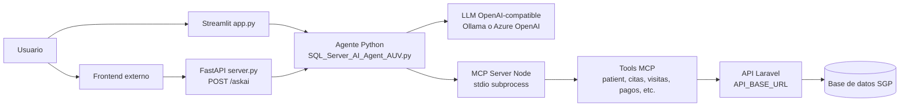
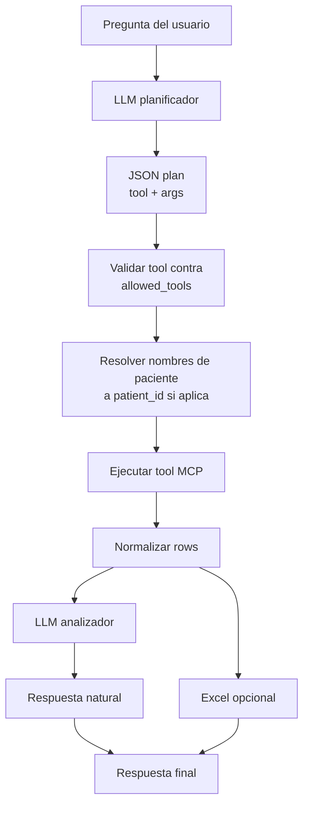
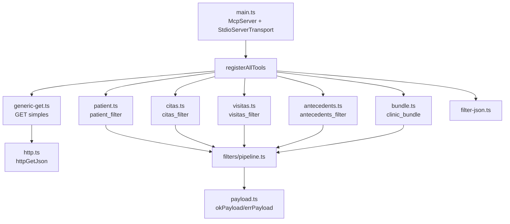
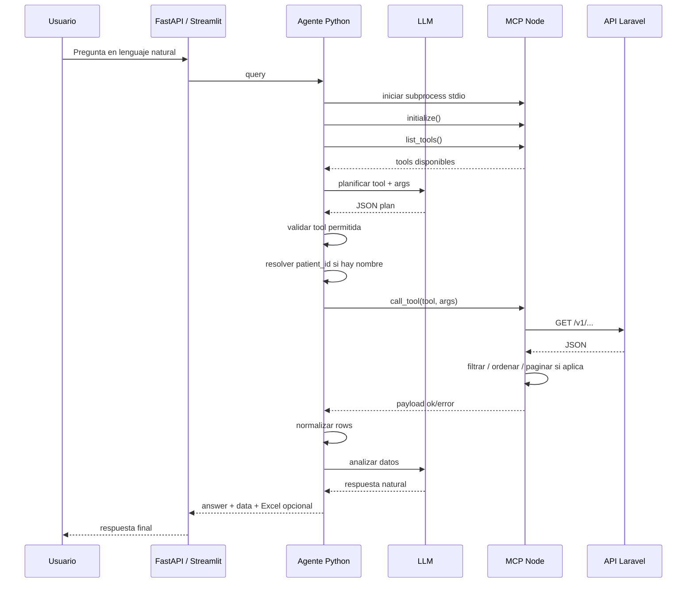
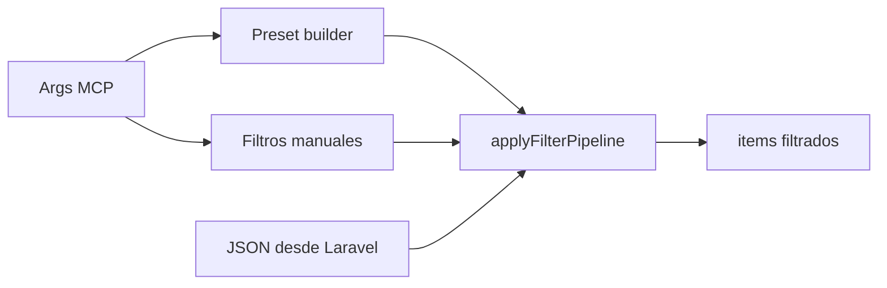
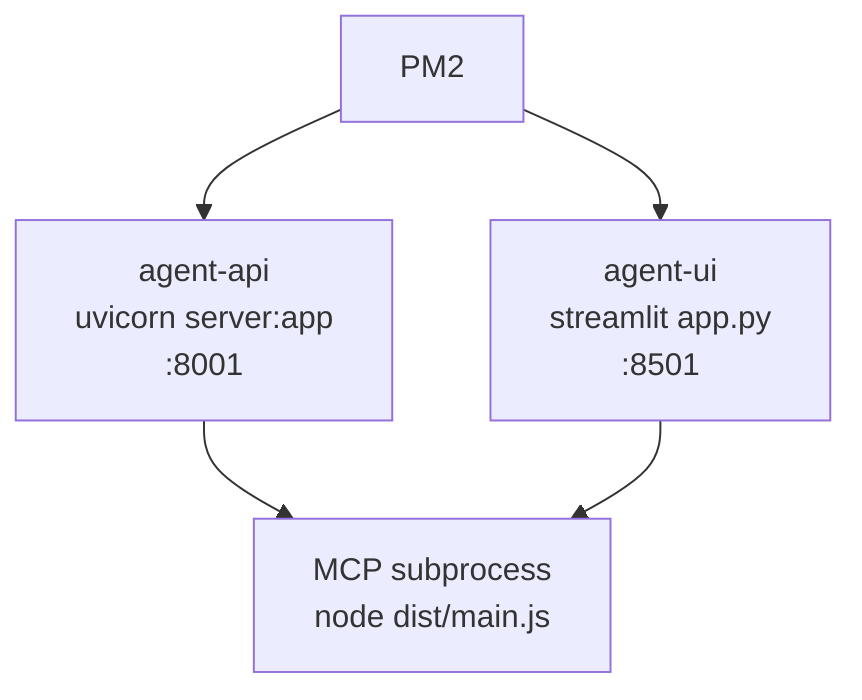
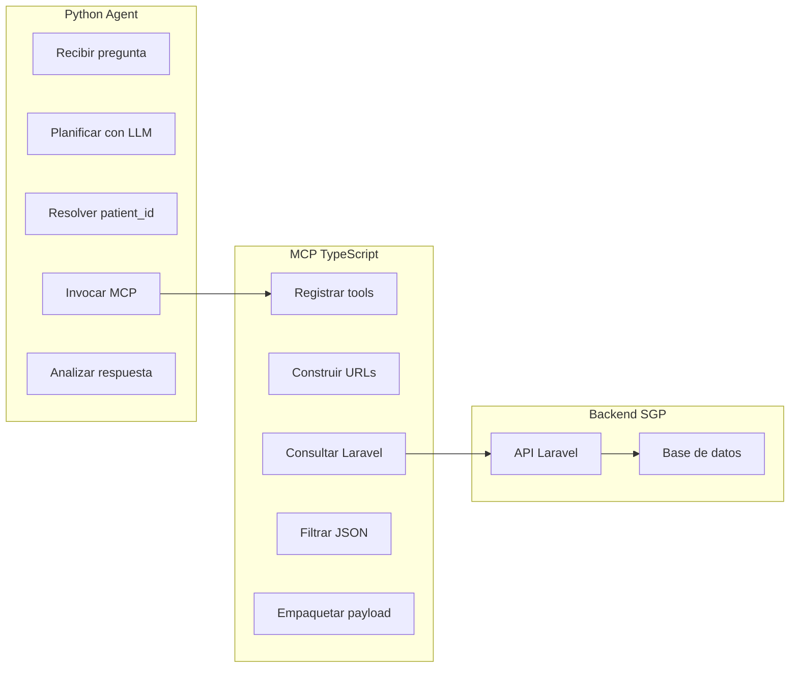

# Arquitectura del Sistema AI Agent + MCP

Este documento describe como esta estructurado el sistema, que responsabilidades tiene cada componente y como fluye una consulta desde el usuario hasta la API Laravel.

> Nota: el repositorio contiene dos arboles similares: `python_agent/` + `mcp_server/` y `Refactor/python_agent/` + `Refactor/mcp_server/`. Esta documentacion toma como referencia principal la version `Refactor/`, que es la version LLM-orchestrated revisada y ajustada.

## Vista General

El sistema esta compuesto por tres capas principales:

1. **Cliente / interfaz**: Streamlit o un frontend externo que consume FastAPI.
2. **Agente Python**: recibe la pregunta, usa un LLM para planificar, ejecuta tools MCP y naturaliza la respuesta.
3. **MCP Server Node/TypeScript**: expone tools que consultan una API Laravel por HTTP.



## Estructura de Carpetas

```text
ai-prueba-deploy/
├── README.md
├── ARQUITECTURA_SISTEMA.md
├── ecosystem.config.cjs
├── install.sh
├── python_agent/              # Version raiz
├── mcp_server/                # Version raiz
└── Refactor/
    ├── python_agent/
    │   ├── SQL_Server_AI_Agent_AUV.py
    │   ├── server.py
    │   ├── app.py
    │   ├── main.py
    │   ├── requirements.txt
    │   └── .env.example
    └── mcp_server/
        ├── main.ts
        ├── package.json
        ├── tsconfig.json
        └── src/
            ├── config.ts
            ├── http.ts
            ├── payload.ts
            ├── filters/
            ├── presets/
            └── tools/
```

## Componentes Principales

### 1. Interfaz Streamlit

Archivo principal: `Refactor/python_agent/app.py`

Responsabilidades:

- Mostrar una caja de texto para preguntas del usuario.
- Ejecutar el agente mediante `Runner`.
- Mostrar la respuesta natural.
- Mostrar tabla solo cuando el usuario lo solicita explicitamente.
- Ofrecer descarga Excel cuando el agente genera `excel_bytes`.

### 2. API FastAPI

Archivo principal: `Refactor/python_agent/server.py`

Endpoint principal:

```text
POST /askai
```

Responsabilidades:

- Recibir `query`.
- Limitar concurrencia con `MAX_CONCURRENT_REQUESTS`.
- Ejecutar `ask_with_embedded_mcp`.
- Normalizar la respuesta con este contrato:

```json
{
  "explanation": "respuesta natural",
  "data": {
    "rows": [],
    "row_count": 0
  },
  "sql_executed": null,
  "excel_name": null,
  "excel_bytes": null
}
```

### 3. Agente Python

Archivo principal: `Refactor/python_agent/SQL_Server_AI_Agent_AUV.py`

El agente trabaja en cinco pasos:

1. Construye cliente LLM.
2. Lanza el MCP server como subprocess Node via stdio.
3. Lista tools disponibles.
4. Usa el LLM planificador para decidir que tool llamar.
5. Ejecuta la tool y usa el LLM analizador para responder en lenguaje natural.



#### Planificador

El prompt `PLANNER_SYSTEM` fuerza una salida JSON con este formato:

```json
{"tool": "nombre_tool", "args": {}}
```

Si la pregunta no requiere datos del sistema:

```json
{"tool": null, "args": {}}
```

Las tools visibles para el planner se controlan con `_PLANNER_TOOLS`. Esto evita saturar al LLM con todas las tools internas y reduce errores de seleccion.

#### Analizador

El prompt `ANALYZER_SYSTEM` recibe:

- Pregunta original.
- Total de filas.
- Filas devueltas por el MCP, hasta `MAX_ROWS_TO_LLM`.
- Contexto extra cuando la tool devuelve un objeto plano, como dashboard o estadisticas.

El analizador no debe inventar informacion y debe usar solo los datos proporcionados.

### 4. MCP Server Node/TypeScript

Archivo principal: `Refactor/mcp_server/main.ts`

El MCP server se ejecuta por `stdio`, no como servicio HTTP independiente. El agente Python lo lanza en cada consulta usando:

```text
node dist/main.js
```



## Flujo Detallado de una Consulta



## Tools MCP por Dominio

### Tools GET simples

Archivo: `Refactor/mcp_server/src/tools/generic-get.ts`

Ejemplos:

- `person_list`
- `person_get`
- `patient_list`
- `patient_get`
- `citas_list`
- `citas_by_patient`
- `visitas_by_patient`
- `visitas_by_cita`
- `dashboard_stats`
- `payments_list`
- `payments_statistics`
- `payments_by_patient`
- `recetas_by_visita`
- `estudios_by_patient`
- `estudios_by_cita`
- `notas_by_cita`
- `archivos_by_patient`

Estas tools construyen una URL a partir de `API_BASE_URL`, rellenan parametros de path y ejecutan `httpGetJson`.

### Tools con filtros locales

Archivos:

- `src/tools/patient.ts`
- `src/tools/citas.ts`
- `src/tools/visitas.ts`
- `src/tools/antecedents.ts`

Estas tools:

1. Consultan un endpoint Laravel.
2. Aplican presets y filtros locales.
3. Devuelven un payload con `total`, `page`, `pageSize`, `returned` e `items`.



### clinic_bundle

Archivo: `Refactor/mcp_server/src/tools/bundle.ts`

`clinic_bundle` permite consultar varias secciones en una sola llamada:

- `person`
- `patient`
- `citas`
- `visitas`
- `antecedents`

Es util para preguntas complejas donde el agente necesita juntar contexto de varias entidades.

## Configuracion

Variables relevantes en `Refactor/python_agent/.env.example`:

```text
NODE_MCP_ENTRY=/ruta/al/mcp_server/dist/main.js
NODE_MCP_CWD=/ruta/al/mcp_server
API_BASE_URL=https://tu-laravel.com/api
API_TOKEN=
LLM_PROVIDER=openai_compat
LLAMA_BASE_URL=http://localhost:11434/v1
LLAMA_MODEL=qwen2.5:3b
MCP_INIT_TIMEOUT=60
MCP_TOOL_TIMEOUT=30
LLM_TIMEOUT=35
OVERALL_TIMEOUT=120
HTTP_TIMEOUT_MS=25000
MAX_ROWS_TO_LLM=100
ALLOW_ORIGINS=http://localhost:3000
MAX_CONCURRENT_REQUESTS=3
```

## Despliegue con PM2

El MCP no se declara como proceso PM2 separado. PM2 administra:

- `agent-api`: FastAPI en puerto `8001`.
- `agent-ui`: Streamlit en puerto `8501`.



## Consideraciones de Seguridad y Operacion

El sistema ya tiene algunos controles:

- MCP por `stdio`, sin exponer un puerto HTTP propio.
- Timeouts para MCP, HTTP, LLM y ejecucion total.
- Allowlist de tools disponibles para el planificador.
- Validacion de tool contra `allowed_tools` antes de ejecutar.
- Concurrencia limitada en FastAPI.
- `stripInternalFields` en el pipeline TypeScript para remover campos internos comunes.

Puntos recomendados si el sistema se expone fuera de una red controlada:

- Autenticacion simple por API key en `/askai`.
- Autorizacion por usuario, rol y paciente.
- Logs estructurados con `request_id`, tool, args normalizados y duracion.
- Redaccion o minimizacion de datos antes de enviarlos al LLM si el caso de uso lo permite.
- Pruebas automatizadas para preguntas frecuentes, casos ambiguos y regresiones.
- Actualizacion periodica de dependencias y revision con `npm audit`.

## Resumen de Responsabilidades



